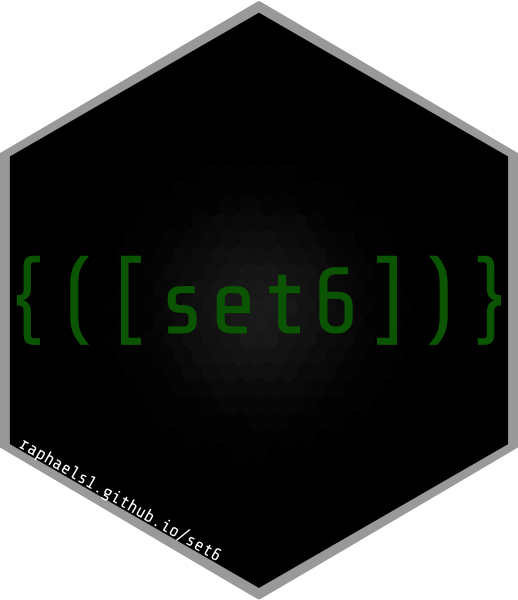

set6
================




[](https://codecov.io/gh/xoopR/set6)
[](https://www.repostatus.org/#active)
[](https://img.shields.io/badge/lifecycle-stable-brightgreen)
[](https://cran.r-project.org/package=set6)
[](https://cran.r-project.org/web/checks/check_results_set6.html)
[](https://zenodo.org/badge/latestdoi/197164551)
[](https://opensource.org/licenses/MIT)
[](https://cran.r-project.org/package=set6)
[](https://CRAN.R-project.org/package=set6)
[](https://gitter.im/xoopR/set6)

## What is set6?

`set6` is an R6 upgrade to the `sets` package in R that includes:

  - Multi-dimensional sets
  - Tuples
  - Finite and infinite intervals
  - Fuzzy sets and tuples
  - Set operations including union, intersect, (asymmetric and
    symmetric) difference, and product
  - Symbolic representation of infinite sets including common special
    sets such as the Reals and Integers
  - ConditionalSets for defining sets according to logical conditions

## Installation

The current CRAN release can be installed with

``` r
install.packages("set6")
```

Or for the latest stable build

``` r
remotes::install_github("xoopR/set6")
```

## Main Features

### A Clear Inheritance Structure

``` r
# Sets require elements to be unique and order doesn't matter
Set$new(1, 2, 1) == Set$new(1, 2)
#> [1] TRUE
Set$new(1, 2) == Set$new(2, 1)
#> [1] TRUE

# But tuples can enforce these restrictions
Tuple$new(1, 2, 1) != Tuple$new(1, 2)
#> [1] TRUE
Tuple$new(1, 2) != Tuple$new(2, 1)
#> [1] TRUE

# Fuzzy sets and tuples extend sets further
f = FuzzySet$new(1, 0, 2, 0.6, 3, 1)
f$inclusion(1)
#> [1] "Not Included"
f$inclusion(2)
#> [1] "Partially Included"
f$inclusion(3)
#> [1] "Fully Included"

# Symbolic intervals provide a clean way to represent infinite sets
Interval$new()
#> [-∞,+∞]
# Different closure types and classes are possible
Interval$new(1, 7, type = "(]") # half-open
#> (1,7]
Interval$new(1, 7, class = "integer") == Set$new(1:7)
#> [1] TRUE

# And SpecialSets inheriting from these intervals
Reals$new()
#> ℝ
PosRationals$new()
#> ℚ+
```

### Set operations

``` r
# Union
Set$new(1, 4, "a", "b") + Set$new(5)
#> {1, 4,...,b, 5}
Interval$new(1, 5) + FuzzyTuple$new(1, 0.6)
#> [1,5]

# Power
Set$new(1:5)^2
#> {1, 2,...,4, 5}^2
# A symbolic representation is also possible
setpower(Set$new(1:5), power = 2, simplify = FALSE)
#> {1, 2,...,4, 5}^2
Reals$new()^5
#> ℝ^5

# Product
Set$new(1,2) * Set$new(5, 6)
#> {1, 2} × {5, 6}
Interval$new(1,5) * Tuple$new(3)
#> [1,5] × (3)

# Intersection
Set$new(1:5) & Set$new(4:10)
#> {4, 5}
ConditionalSet$new(function(x) x == 0) & Set$new(-2:2)
#> {0}
Interval$new(1, 10) & Set$new(5:6)
#> {5, 6}

# Difference
Interval$new(1, 10) - Set$new(5)
#> [1,5) ∪ (5,10]
Set$new(1:5) - Set$new(2:3)
#> {1, 4, 5}
```

### Containedness and Comparators

``` r
Interval$new(1, 10)$contains(5)
#> [1] TRUE
# check multiple elements
Interval$new(1, 10)$contains(8:12)
#> [1]  TRUE  TRUE  TRUE FALSE FALSE
# only return TRUE if all are TRUE
Interval$new(1, 10)$contains(8:12, all = TRUE)
#> [1] FALSE
# decide whether open bounds should be included
Interval$new(1, 10, type = "()")$contains(10, bound = TRUE)
#> [1] TRUE
Interval$new(1, 10, type = "()")$contains(10, bound = TRUE)
#> [1] TRUE

Interval$new(1, 5, class = "numeric")$equals(Set$new(1:5))
#> [1] FALSE
Interval$new(1, 5, class = "integer")$equals(Set$new(1:5))
#> [1] TRUE

Set$new(1) == FuzzySet$new(1, 1)
#> [1] TRUE

# proper subsets
Set$new(1:3)$isSubset(Set$new(1), proper = TRUE)
#> [1] TRUE
Set$new(1) < Set$new(1:3)
#> [1] TRUE

# (non-proper) subsets
Set$new(1:3)$isSubset(Set$new(1:3), proper = FALSE)
#> [1] TRUE
Set$new(1:3) <= Set$new(1:3)
#> [1] TRUE

# multi-dimensional checks
x = PosReals$new()^2
x$contains(list(Tuple$new(1, 1), Tuple$new(-2, 3)))
#> [1]  TRUE FALSE
```

## Usage

The primary use-cases of `set6` are:

1.  **Upgrading sets** Extend the R `sets` package to R6, which allows
    for generalised `Set` objects with a clear inheritance structure. As
    well as adding features including symbolic representation of
    infinite sets, and cartesian products.
2.  **Defining parameter interfaces** All objects inheriting from the
    `Set` parent class include methods `equals` and `contains`, which
    are used to check if two sets are equal or if elements lie in the
    given set. This makes `set6` ideal for parameter interfaces in which
    a range of values (possibly multi-dimensional or of mixed types)
    need to be defined.

## Short-term development plans

Whilst the `set6` API is stable, it is considered ‘maturing’, and
therefore whilst there are no plans for major updates, these may still
occur. There are a few features and refactoring we plan on implementing
before we consider the package to be in its first complete version.
These mainly include

  - Finalising all methods and fields - some are missing or possibly
    inaccurate for some wrappers. For example the cardinality of
    `ComplementSet`s is imprecise at the moment.
  - We are considering adding a `simplify` method to wrappers to reduce
    classes inheriting from `SetWrapper` to simpler sets. This allows
    users to perform operations with `simplify = FALSE` and then to
    change their mind.
  - There are some inefficient loops implemented that will need
    refactoring for more efficient code.
  - Adding more tutorials to make the interface easier for beginners,
    especially people new to R6

At a later stage we may consider adding Venn diagrams for visualisation
of sets and intervals, but this is very low priority.

## Similar Packages

  - [sets](https://CRAN.R-project.org/package=sets) - The **sets**
    package uses S3 to define some symbolic representaton of
    mathematical sets, tuple, intervals, and fuzzy variants. However the
    symbolic representation is not consistent throughout the package,
    does not allow for clear inspection of set/interval elements, and
    there is no support for multi-dimensional sets.

  - [BaseSet](https://github.com/llrs/BaseSet) - The **BaseSet** package
    focuses on storing and analysing sets in a ‘tidy’ way, with more
    options for data storage in long and wide formats. The primary usage
    is neat and efficient inspection of finite sets, there is no support
    for infinite sets or symbolic representation.

## Contributing

As `set6` is in its early stages, contributions are very welcome. If you
have any ideas for good features please open an issue or create a pull
request. Otherwise bug reports are very appreciated if you stumble
across any broken code, these can be posted to the [issue
tracker](https://github.com/xoopR/set6/issues). For updates on `set6`
follow/star this repo.
